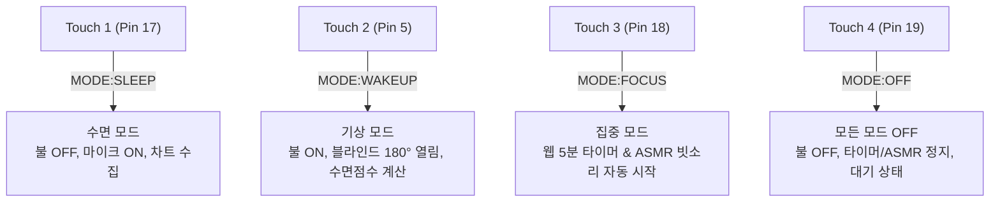

# 🏠 JINJIN Smart Home 스마트홈 시스템 스마트 가이드라인 (smart_home_guideline.md)

> **프로젝트명**: JINJIN HOME - 스마트홈 모바일 대시보드 & ESP32 MicroPython 시스템  
> **제작자**: 김진아 (Jina), 오예진 (Yejin)  
> **최종 업데이트**: 2026년 7월 28일  

---

## 1. 📌 프로젝트 개요 (Project Overview)

**JINJIN HOME**은 ESP32 마이크로콘트롤러 보드와 모바일 웹 대시보드를 **Web Bluetooth (Nordic UART Service - NUS)** 통신으로 실시간 연동하는 글래스모피즘 스마트홈 제어 시스템입니다.

- **모바일 퍼스트 글래스모피즘 UI**: 다크 모드 / 라이트 모드 전환 및 모바일 앱 쉘 환경
- **실시간 센서 텔레메트리 & 수면 점수 분석**: 수면 모드 시 코골이 음량 파형 추적, 수면 점수 계산, 차트 시각화
- **스마트 디스플레이 & 조명 제어**: 듀얼 OLED 디스플레이 (날씨 그래픽, 영단어+활용문장, 날짜+할일/화이팅), RGB LED 무드 컬러
- **하드웨어 4핀 터치 센서 동기화**: 터치 버튼 1~4 누름 시 웹 대시보드와 하드웨어가 100% 양방향 자동 연동
- **집중 타이머 & ASMR 오디오**: 브라우저 Web Audio API 기반 백색소음(빗소리) 및 뽀모도로 타이머 완료 시 피에조 부저 알람

---

## 📁 2. 프로젝트 파일 구조 (Repository Architecture)

```
.
├── index.html              # 스마트홈 웹 대시보드 메인 HTML (화면 구조 & UI 컴포넌트)
├── style.css               # 글래스모피즘 스타일시트 (라이트/야간 테마 & 반응형 모바일 UI)
├── app.js                  # 웹 앱 핵심 로직 (Web Bluetooth, 센서 차트, 수면 점수, ASMR, AI 챗봇)
├── JJ_smartHome.py         # ESP32 마이크로파이썬 (MicroPython) 전용 하드웨어 제어 스크립트
├── prd_smart_home.md       # 프로젝트 요구사항 및 개발 명세서
├── smart_home_guideline.md # 프로젝트 통합 가이드라인 (본 문서)
└── api/
    ├── gemini.js           # Google Gemini AI 도우미 서버리스 API Proxy
    ├── todos.js            # 할 일 목록 Cloud DB (Vercel KV / Upstash Redis 연동)
    └── weather.js          # OpenWeatherMap 실시간 날씨 API Proxy
```

---

## 🔌 3. ESP32 하드웨어 핀 맵 (Pinout Mapping)

| 부품 / 센서명 | 핀 번호 | 인터페이스 | 역할 및 동작 설명 |
| :--- | :---: | :---: | :--- |
| **조도 센서 (LDR CDS)** | `Pin 36` | ADC (11dB) | 실내 밝기 측정 및 조도 자동 블라인드 연동 |
| **마이크 센서 (Mic)** | `Pin 34` | ADC (11dB) | 수면 모드 시 고속 파형 샘플링 & 코골이 음량 분석 |
| **서보 모터 (Servo)** | `Pin 13` | PWM | 스마트 창문 블라인드 각도 조절 (0° 닫힘, 90° 절반, 180° 열림) |
| **피에조 부저 (Buzzer)** | `Pin 23` | PWM | 집중 타이머 완료 알람, 부저 멜로디(학교종, 8음계) 연주 |
| **RGB 무드 LED** | `Pin 25`(R), `26`(G), `27`(B) | Digital Out | 스마트 조명 ON/OFF, HEX 무드 컬러 및 고습도 경고 점등 |
| **DHT11 온습도 센서** | `Pin 14` | OneWire | 실내 온도(°C) 및 습도(%) 실시간 측정 |
| **OLED 1번 디스플레이** | `Pin 21`(SDA), `Pin 22`(SCL) | SoftI2C | 실시간 날씨 아이콘(맑음/비/눈/구름), 영단어 카드, 오늘의 날짜 |
| **OLED 2번 디스플레이** | `Pin 4`(SDA), `Pin 16`(SCL) | SoftI2C | 실내 온습도/조도, 영단어 활용 문장, 할 일 목록 ("Today Fighting!") |
| **터치 1 센서 (Touch 1)** | `Pin 17` | Digital In | 물리 버튼 1: 수면 모드 시작 |
| **터치 2 센서 (Touch 2)** | `Pin 5` | Digital In | 물리 버튼 2: 기상 모드 진입 |
| **터치 3 센서 (Touch 3)** | `Pin 18` | Digital In | 물리 버튼 3: 집중 모드 진입 (웹 5분 타이머 & ASMR 자동 실행) |
| **터치 4 센서 (Touch 4)** | `Pin 19` | Digital In | 물리 버튼 4: 모든 모드 OFF (스마트홈 대기 상태) |

---

## 🖐️ 4. 하드웨어 터치 버튼 (Touch 1~4) 제어 명세

ESP32 보드의 정전식 터치 센서 4핀을 터치하면 **하드웨어 동작과 동시에 웹 대시보드 모드가 자동으로 연동**됩니다.



1. **Touch 1 (Pin 17) - 수면 모드**:
   - `R, G, B` 불을 모두 소등 (`OFF`)
   - 마이크 음성 감지 ON (`mic_active = True`)
   - 웹앱으로 `MODE:SLEEP` 송신 → 웹앱 수면 모드 UI 자동 활성화
2. **Touch 2 (Pin 5) - 기상 모드**:
   - `R, G, B` 불을 모두 점등 (`ON`)
   - 서보 모터를 180도로 회전시켜 블라인드 자동 걷기 (`motor.move(180)`)
   - 마이크 음성 감지 OFF, 센서 1회 동기화
   - 웹앱으로 `MODE:WAKEUP` 송신 → 웹앱 기상 모드 UI 자동 활성화 & 수면 점수 계산
3. **Touch 3 (Pin 18) - 집중 모드**:
   - 웜 옐로우 무드등 점등 (`R=ON, G=ON, B=OFF`)
   - 웹앱으로 `MODE:FOCUS` 송신 → 웹앱에서 **5분 집중 타이머가 자동으로 세팅 및 시작**되며 **백색소음(ASMR 빗소리) 자동 재생**
4. **Touch 4 (Pin 19) - 모든 모드 OFF**:
   - `R, G, B` 불 소등 (`OFF`), 부저/센서 정지
   - 웹앱으로 `MODE:OFF` 송신 → 웹앱의 모든 모드 카드 OFF, ASMR 및 타이머 자동 정지

---

## 📶 5. Web Bluetooth (NUS) 양방향 통신 규격

### 📤 5.1 웹 대시보드 ➔ ESP32 수신 명령어

| Command String | 설명 및 동작 |
| :--- | :--- |
| **`1`** / **`w`** / **`sync`** | 실시간 날씨 및 센서 1회 수동 동기화 (OLED 1, 2 갱신 + `temp:XX`, `humi:YY` 송신) |
| **`2`** | 조도 센서(CDS) 측정값 1회 표시 및 웹 송신 |
| **`3`** / **`4`** | 1번 OLED 화면 켜기(`poweron`) / 끄기(`poweroff`) |
| **`5`** / **`F_ALARM`** | 학교종 멜로디 또는 집중 타이머 완료 알람 부저 재생 |
| **`6`** / **`shark`** | 아기상어 (Baby Shark) 멜로디 부저 연주 |
| **`7`** / **`8`** | RGB LED 전체 켜기 (`ON`) / 전체 끄기 (`OFF`) |
| **`9`** | 2번 OLED에 헬로키티 (`img/kitty.pbm`) 단색 비트맵 이미지 출력 |
| **`S`** | 수면 모드 시작 (RGB 소등, 마이크 ON) |
| **`Q`** | 기상 모드 진입 (RGB 점등, 블라인드 180° 개방, 마이크 OFF) |
| **`A`** | 부저 알람 및 경보음 즉시 끄기 |
| **`M0`** ~ **`M180`** | 서보 모터 직접 각도 제어 (예: `M180` -> 블라인드 180° 열림) |
| **`W:영단어|뜻|문장`** | OLED 1(영단어+뜻), OLED 2(활용 문장) 분할 드로잉 (예: `W:SERENDIPITY|뜻밖의 행운|Finding joy...`) |
| **`T:날짜|할일`** | OLED 1(오늘 날짜), OLED 2(할 일 내용 또는 "Today Fighting!") 드로잉 |
| **`C#HEX`** / **`CHEX`** | HEX 무드 컬러 파싱 및 RGB LED 핀 조합 조절 (예: `C#38BDF8`) |
| **`O1`** / **`O2`** / **`O3`** | OLED 디스플레이 모드 전환 (`O1`: 날씨/온습도, `O2`: 영단어, `O3`: 날짜/할일) |
| **`B_AUTO:1`** / **`0`** | 조도 센서 기반 블라인드 자동 개방 연동 ON/OFF |
| **`H_ALERT:1`** / **`0`** | 고습도 안내 경보 연동 ON/OFF |
| **`H_TH:습도`** | 고습도 경보 작동 습도 기준치 설정 (예: `H_TH:75`) |

### 📥 5.2 ESP32 ➔ 웹 대시보드 송신 데이터 (Telemetry & Events)

| Send String | 설명 및 웹 동작 |
| :--- | :--- |
| `temp : 24\n` | 실내 온도 측정값 (`#sensor-temp`, `#weather-temp-val` 갱신) |
| `humi : 55\n` | 실내 습도 측정값 (`#sensor-humi`, `#weather-humi-val` 갱신) |
| `3200\n` | 조도 센서(LDR) 측정값 (`#sensor-cds` 갱신) |
| `Mic Level: 15\n` | 수면 모드 실시간 음량 데이터 (`#sensor-mic` 갱신 & Chart.js 그래프 생성) |
| `SNORING_ALERT\n` | 코골이 3회 감지 신호 (부저 무음, 웹앱 수면 점수 차트 카운팅 전송) |
| `MODE:SLEEP\n` | 터치 1 감지 신호 → 웹앱 수면 모드 UI 자동 활성화 |
| `MODE:WAKEUP\n` | 터치 2 감지 신호 → 웹앱 기상 모드 UI 자동 활성화 및 수면 점수 계산 |
| `MODE:FOCUS\n` | 터치 3 감지 신호 → 웹앱 집중 모드 UI 자동 활성화 (5분 타이머 & ASMR 시작) |
| `MODE:OFF\n` | 터치 4 감지 신호 → 웹앱 모든 모드 OFF 전환 |

---

## 🎯 6. 핵심 기능 구현 및 작동 가이드

### 1. 💤 스마트 수면 분석 & 코골이 무음 모니터링
- **동작 방식**: 수면 모드 켜짐 시 ESP32는 조명을 전부 끄고 마이크 고속 파형 샘플링을 진행합니다.
- **무음 경보 방식**: 코골이가 3회 연속 감지되면 시끄러운 부저 소리를 울리지 않고 웹으로 `SNORING_ALERT` 신호만 전송하여 사용자의 수면을 방해하지 않고 수면 질 차트에 조용히 카운팅 기록합니다.

### 2. ☀️ 기상 모드 & 수면 분석 점수 리포트
- **동작 방식**: 기상 모드 전환 시 ESP32는 조명을 켜고 스마트 블라인드를 180도 완전히 열어줍니다.
- **수면 점수 리포트**: 수면 모드 작동 시간 및 코골이 감지 횟수를 바탕으로 **100점 만점 기준 수면 분석 점수**가 웹앱 상단 카드에 즉시 계산되어 출력됩니다.

### 3. 🧠 ASMR 백색소음 & 뽀모도로 집중 타이머
- **ASMR 빗소리**: 하드웨어 부저 노이즈 없이 브라우저 Web Audio API를 사용하여 고품질 빗소리 백색소음을 재생합니다.
- **타이머 완료 알람**: 프리셋(5분, 10분, 25분, 45분, 60분) 설정 후 타이머 시간이 만료되면 ESP32 피에조 부저로 축하 알람 멜로디가 연주됩니다.

### 4. 📺 듀얼 OLED 디스플레이 모드
- **영단어 모드**: OLED 1에 영단어(`SERENDIPITY`)와 한글 뜻이 표시되고, OLED 2에 활용 문장이 표시됩니다.
- **날짜 & 할 일 모드**: OLED 1에 오늘 날짜(`2026.07.28`)가 표시되고, OLED 2에 할 일이 표시됩니다. 할 일이 없을 시 **"Today Fighting!" (오늘도 화이팅!)** 문구가 출력됩니다.

### 5. 🤖 AI 도우미 & 0초 대기 빠른 명령어 칩
- 챗봇 상단 **빠른 질문 칩 바**를 클릭하거나 "불 켜줘", "수면모드", "날씨" 등을 입력하면 API 대기시간 없이 **즉시 파이썬 명령어를 전송하여 0초 만에 홈을 제어**합니다.

---

## 🚀 7. 실행 및 배포 가이드 (Deployment Guide)

### 7.1 ESP32 파이썬 펌웨어 설치
1. ESP32 보드에 MicroPython 펌웨어를 플래싱합니다.
2. `Thonny` 또는 `MicroPython REPL`을 통해 루트 폴더에 아래 파이썬 라이브러리 파일들을 업로드합니다:
   - `ssd1306.py` (OLED 드라이버)
   - `servo.py` (서보모터 드라이버)
   - `ble_library.py` (BLE Simple Peripheral 라이브러리)
   - `img/kitty.pbm` (비트맵 이미지 파일)
3. 최상위에 [JJ_smartHome.py](file:///c:/Users/oyj_1/OneDrive/바탕 화면/스마트홈/Antigravity/JJ_smartHome.py)를 업로드하고 실행합니다.

### 7.2 웹 대시보드 배포 및 접속
- **GitHub Pages**: 레포지토리 Settings ➔ Pages ➔ Source를 `main` 브랜치 / `root` 경로로 설정하여 배포합니다.
- **Vercel**: GitHub 레포지토리를 Vercel 프로젝트로 임포트하여 배포합니다. (`/api` 서버리스 함수 자동 연동)
- Chrome / Edge / Android 삼성 브라우저 등 **Web Bluetooth API 지원 브라우저**에서 접속 후 우측 상단 **[ESP32]** 버튼을 눌러 블루투스로 연결합니다.

---

> **Copyright ⓒ 2026 JINJIN Smart Home All Rights Reserved.**  
> Designed & Engineered by Jina & Yejin.
